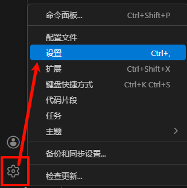
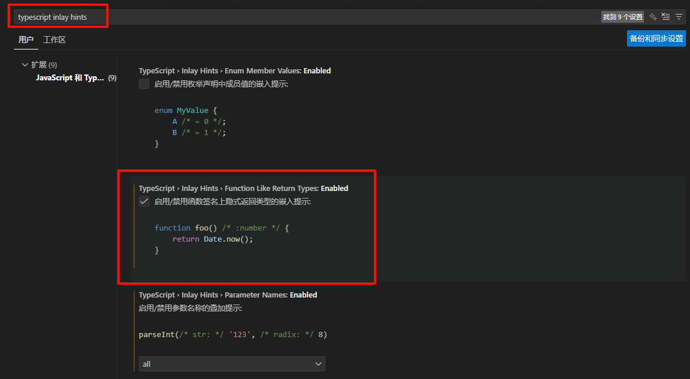

# TS开发环境搭配

这个模块主要是学习掘金上林不渡的ts小册时做的笔记，期间有些东西会借用AI辅助。所有 **`今日结语`** 都来自AI，希望你看到时也能被激励到。

## JS和TS的简单区别

- JavaScript 自由但缺少类型，开发复杂应用效率不高且易出现调用 undefined 值等问题导致线上故障。
- TypeScript 基于 JavaScript 添加类型，能弥补 JavaScript 遗憾，可提前感知变量类型、发现潜在问题并给予编写代码时的提示。

## TS的定位

- 编程语言：和 JavaScript 并列，基于 JavaScript 开发，添加了类型这一 JavaScript 被人诟病缺失的能力。
- 需编译：因浏览器只能执行 JS 文件，且 TypeScript 诞生晚、由微软维护，所以需通过编译工具 tsc 将 TypeScript 编译为 JavaScript，擦除类型后得到原汁原味的 JS 代码。
- 具备类似 Babel 功能：JS 迭代慢，新语法使用需等待浏览器支持或引入 Babel 编译。TypeScript 团队利用编译过程，让开发者提前使用 JS 未完全支持的语法，编译时转换为低版本浏览器可运行的语法，同时引入配置文件 tsconfig.json 进行编译等能力配置。

## 编辑器简单配置

1. 第一步打开设置  

2. 输入`typescript inlay hints`，然后修改TS配置项  
  推荐修改项：
    - Function Like Return Types，显示推导得到的函数返回值类型；
    - Parameter Names，显示函数入参的名称；
    - Parameter Types，显示函数入参的类型；
    - Variable Types，显示变量的类型。

    

## 今日结语
  >学TS的你，像在代码宇宙种下星星，未来必定闪耀！✨
