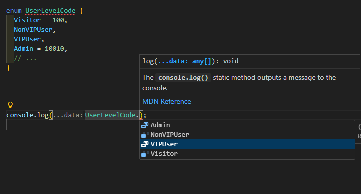

## javascript类型体系
### 原始类型
- **字符串** (`string`): `const userNick = 'linbudu';`
- **数字** (`number`): `const userAge = 18;`
- **布尔值** (`boolean`): `const userMarried = false;`
- **特殊值**:
  - `null`: `const userNull = null;`
  - `undefined`: `const userUndefined = undefined;`

### 对象类型
- **普通对象**: `const userObject = {};`
- **数组**: `const userList = [];`
- **函数/其他复杂类型**

JavaScript 中的变量声明存在这么一个问题：一个（let 声明的）变量可以被赋值为任意类型。  
TypeScript，当我们声明一个变量并赋值后，它的类型就确定了

## TypeScript 的类型解决方案

1. 类型推断（Type Inference）  
  首次赋值后锁定类型
    ```typescript
      typescript
      let userAge = 0;      // 推断为 number
      userAge = 'linbudu';  // 报错：不能将 string 分配给 number
    ```
2. 显式类型标注（Type Annotation）  
  声明时指定类型
    ```typescript
      let userAge: number;      // 显式标注为 number
      userAge = 18;             // 正确
      userAge = '18';           // 报错：类型不匹配

      const userName: string = 'linbudu'; // 字符串类型
    ```
3. 类型提示（Type Hints）  
  IDE 自动补全  
  基于类型标注或推断，提供属性/方法提示：  
  字符串：.length, .toUpperCase()  
  数组：.map(), .filter()  
  对象：属性名补全

## 类型标注

 ```typescript
// 原始类型：直接：类型
const userName: string = 'linbudu';
const userAge: number = 18;
const userMarried: boolean = false;

// 数组类型：两种方式
// 字符串数组
const userNames1: string[] = [];
const userNames2: Array<string> = [];

// 数组数组
const userNames1: number[] = [];
const userNames2: Array<number> = [];

// 对象类型：需要先创建一个接口(interface),然后用这个接口作为对象类型变量的类型标注
interface User {
  userName: string;
  userAge: number;
  userMarried: boolean;
}
const user: User = {
  userName: 'test',
  userAge: 20,
  userMarried: false,
};

// 而接口加上数组类型，就可以描述一个成员是对象的数组类型
interface User {
  userName: string;
  userAge: number;
  userMarried: boolean;
}
const userList: User[] = [
  {
    userName: 'test',
    userAge: 20,
    userMarried: false,
  },
  {
    userName: 'test',
    userAge: 20,
    userMarried: false,
  },
  {
    userName: 'test',
    userAge: 20,
    userMarried: false,
  },
];
 ```

 ## 枚举类型
 一个不错的常量定义方式。枚举能够提供清晰的提示，甚至可以看到这个枚举成员的值，数字类型的值，枚举能够自动累加值。
 ```typescript
 enum UserLevelCode {
  Visitor = 10001,
  NonVIPUser = 10002,
  VIPUser = 10003,
  Admin = 10010,
  // ... 
}
```
清晰提示  
  
枚举值+自动累加  
  
枚举中可以同时支持数字、字符串、函数计算等成员  
```typescript
function generate() {
  return Math.random() * 10000;
}

enum UserLevelCode {
  Visitor = 10001,
  NonVIPUser = 10002,
  VIPUser,
  Admin,
  Mixed = 'Mixed',
  Random = generate(),
  // ...
}
```
## 今日结语
>你学TS时专注的样子，像在给代码世界织一张闪闪发光的网～💫