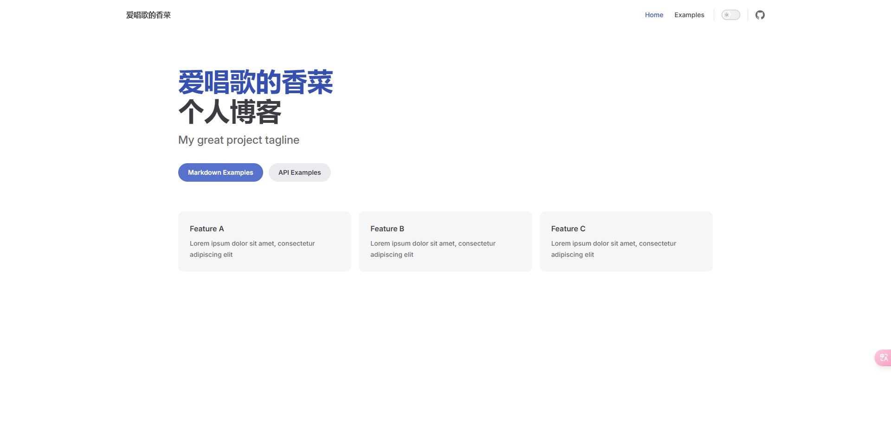

# 快速创建项目
新建项目文件夹   
```js
mkdir viteadmin   创建文件夹
cd viteadmin      进入文件夹
```
下载vitepress
```js
npm i -D vitepress
```
创建模板
```
npx vitepress init
```
回答问题
1. Where should vitePress initialize the config?【vitepress应该在什么地方初始化配置：直接回车】
1. Site title【网站标题：自己填】
1. Site description【网站描述：自己填】
1. Default Theme (Out of the box, good-looking docs)【默认主题（开箱即用，文档优美）：我的选择】
1. Default Theme + Customization【默认主题+自定义】
1. Custom Theme【自定义主题】
1. Use TypeScript for config and theme files?【配置和主题文件使用ts:不】
1. Add VitePress npm scripts to package.json?【在package.json中添加vitepress npm脚本：是】

运行项目
```
npm run docs:dev
```
