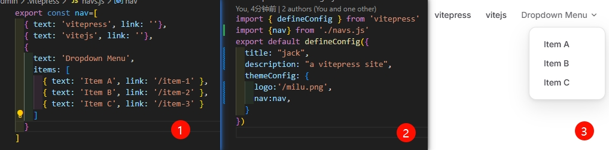

# 博客顶部功能
## 左上角logo和名称
.vitepress/config.mjs
```
import { defineConfig } from 'vitepress'
export default defineConfig({
  title: "左上角的名称",
  themeConfig: {
    logo:'/logo.png',//左上角的图标
  }
})
```
**注意这个图标要放在public文件中，如果没有就创建一个**

## 封装nav.js
这里主要是右上角不同按钮的配置  
为了方便我们后期博客维护，将这里的内容封装成组件。
```
export const nav=[
  { text: 'vitepress', link: ''},
  { text: 'vitejs', link: ''},
  {
    text: 'Dropdown Menu',
    items: [
      { text: 'Item A', link: '/item-1' },
      { text: 'Item B', link: '/item-2' },
      { text: 'Item C', link: '/item-3' }
    ]
  },
]
```
```
import { defineConfig } from 'vitepress'
import {nav} from './navs.js'//本次要注意的内容
export default defineConfig({
  title: "会跳舞的香菜",
  description: "a vitepress site",
  themeConfig: {
    logo:'/milu.png',
    nav:nav,//本次要注意的内容
  }
})
``` 

## 左侧文章列表自定义
```
export const sidebar= {
  '/vitepress使用教程/':[//多目录的写法
    {
      text: 'vitepress',
      items: [
        { text: '创建项目', link: '/vitepress使用教程/创建项目' },
        { text: '博客顶部功能', link: '/vitepress使用教程/博客顶部功能' },
      ]
    }
  ]
}
```
这样些可以实现的效果是：路由发生变化左侧的目录也会发生变化。方便根据不同类别展示不同类型的文章
## 小功能的优化
### 1.上一页下一页中文显示
```
export default defineConfig({
  themeConfig: {
    docFooter: {
      prev: '上一页',
      next: '下一页'
    }
  }
})
```
### 文章目录显示的级别
```
export default defineConfig({
  themeConfig: {
    outline:{
      level:[2,6],
      label:'文章目录'
    },
  }
})
```

